# LIST

* ##### [좌표 변환과 행렬](#transformation-and-matrix)

* ##### [Shape 위주 계산의 유용성](#importance-of-shape)

* ##### [Conjugate Transpose Matrix - 공역전치행렬 또는 켤레전치행렬](#conjugate-transpose-matrix)

* ##### [Transpose Matrix - 전치행렬](#transpose-matrix)

* ##### [Determinant - 행렬식](#determinant)

## Reference

- 프로그래머를 위한 선형대수

# Transformation and Matrix

- ##### 좌표 변환은 '정방행렬 A를 곱한다'라는 형태로 쓸 수 있다. 단, A에는 역행렬이 존재한다.

- ##### 역행렬을 지니는 정방행렬 A를 곱하는 것은 '좌표 변환'이라고 해석할 수 있다.

#### ex) 

다음과 같이 2쌍의 기저(e,e')를 사용해 벡터 v를 다음 두 가지로 표현이 가능한 경우

v와 v'의 관계를 나타내보자.

우선 이때 e와 e'의 대응관계가 다음과 같을 경우.

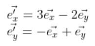

다음과 같이 쓸 수 있다.

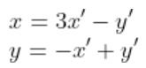

이를 행렬 형태로 나타내면

혹은

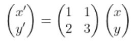

로 쓸 수 있다.

또한, 다음이 성립한다.

# Transpose Matrix

#### 표기법

-  

  

#### 성질

-  
-   
-  
- #####  단, D는 대각행렬이다.

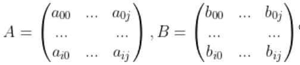일 때, 다음을 만족하는 경우 B는 A의 전치행렬(Transpose Matrix)이다.

즉,  

# Conjugate Transpose Matrix

#### 표기법

-   

#### 성질

-   
-   
-   
-   

#### ex)

# Importance Of Shape

#### 행렬 계산을 할 때 크기에 주목을 해야 한다.

#### ex1)

##### Q.와는 각각 n차원의 열 벡터(혹은 종 벡터)일 때, 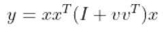를 계산해라.

일반적으로 계산하게 되면 shape은 (nxn)(nxn +(nxn))(nx1)으로 nxn이 많아지게 된다.

하지만 shape에 집중하게 되면 아래와 같이 가능하다.

#### ex2)

##### Q. A는 n차 정방행렬, b와 c는 n차 열 벡터(혹은 종 벡터) 일 때, 다음이 성립함을 증명해라.

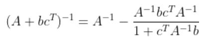

A.

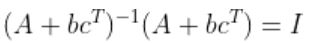이 성립해야 하므로

  

여기서 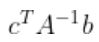는 Scalar이므로 로 두면 식은 다음과 같이 된다.

 

# Determinant

#### 표기법

- 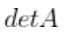  

- ##### , 실수의 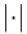와는 다르게 결과값이 음수 일 수 있다.

#### 성질

-   

- 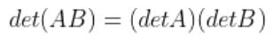 

-  

- ##### 인 행렬은 역행렬이 존재하지 않는다.  이 참이 되어야 하기 때문이다.

- 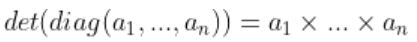  

- 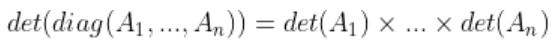  

- ##### 행렬 일 때, 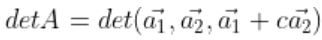

-   

- ##### 다음과 같은 성질을 다중선형성이라고 한다.

  ##### 1.   

  ##### ex)

  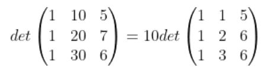

  ##### 2.   

  ##### ex)

  

- ##### 다음과 같은 성질을 교대성이라고한다.

   

  ##### ex)

  

  ##### 상이 역전된다고 해석이 가능하다.

- ##### 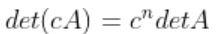, 여기서 n은 행렬 A의 차수.

- ##### 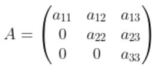로 표현되는 상삼각행렬(Upper triangular matrix) 또는 하삼각행렬 (lower triangular matrix) 일 경우 

#### 특징

- ##### 실수 행렬의 행렬식은 실수이다. 복소 행렬의 행렬식은 일반적으로 복소수이다.

- ##### 정방행렬이 아닌 행렬에서 행렬식은 정의되지 않는다.